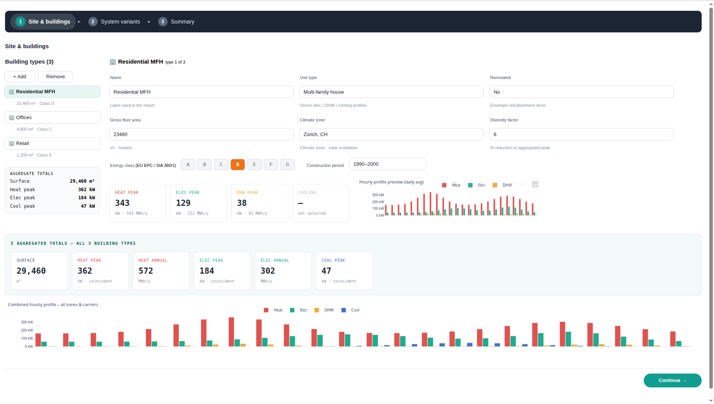

# sympheny-light-app

To run the application, first replace `username` and `password` with your values in `app.py` 

Then follow these steps in your terminal:

1. **Navigate to the project directory:**
   `cd sympheny-light-app`
2. **Install the required dependencies:**
   `pip install -r requirements.txt`
3. **Start the application:**
   `python app.py`
4. **Access the interface:**
   Open the URL printed in the console.

The whole app code is in file `notebook.py`.
Ask Claude AI for modifications.
Then restart the app to see the changes

